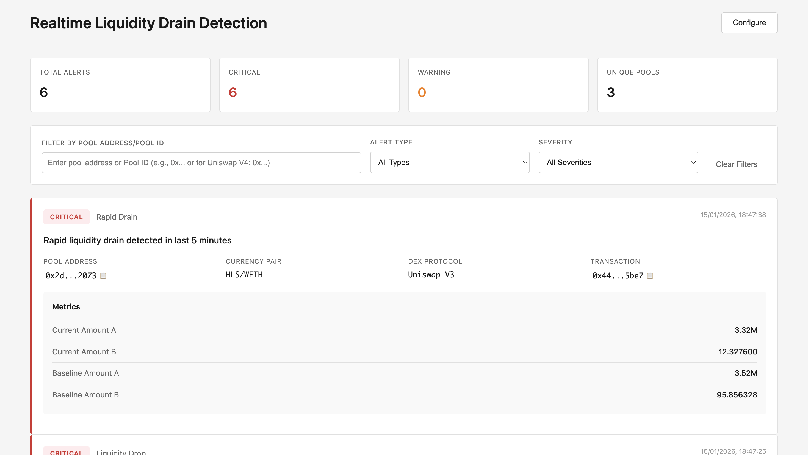

# Realtime Liquidity Drain Detection

Detects liquidity drains in DEX pools by monitoring real-time events from Kafka.



## Setup

1. Install dependencies:

```bash
pip install -r requirements.txt
```

2. Configure credentials (get them from bitquery support team) in `config.sample.py` and change the filename to `config.py`:

```python
username = "your_username"
password = "your_password"
```

## Running

**Start the API server (Frontend):**

```bash
python api_server.py
```

Access at: `http://localhost:5001`

**Start the detector:**

```bash
python liquidity_drain_detector.py
```

The detector will send alerts to the API server automatically.

## Configuration

Edit thresholds in `detection_config.py`:

- `LIQUIDITY_DROP_WARNING/CRITICAL`: Drop percentage thresholds
- `MAX_AMOUNT_DECREASE_WARNING/CRITICAL`: Max trade size drop thresholds
- `DROP_CONFIRMATION_COUNT`: Number of consecutive drops required before alerting

## Sample Alert Output

When a liquidity drain is detected, the detector outputs a detailed alert:

```
================================================================================
🚨 LIQUIDITY DRAIN ALERT - CRITICAL
================================================================================
Type: liquidity_drop
Pool ID: 0x10bd2f65f40bc8b7ddb6f104c603d022cd8a0ddf_0xc02aaa39b223fe8d0a0e5c4f27ead9083c756cc2_0xdd9f7920b7c77efa8d1c19e3a7c1151f985f75a6
Pool Address: 0x10bd2f65f40bc8b7ddb6f104c603d022cd8a0ddf
Pair: WETH/ASTRE
DEX: uniswap_v2
Transaction Hash: 0x73470ed71e7b251d0e94078559d3c9005dc14187f55b61ad9435e99feb2341ea
Time: 2026-01-15 13:17:25 UTC

ASTRE dropped 90.4% from baseline

Current State:
  Currency A: WETH (0xc02aaa39b223fe8d0a0e5c4f27ead9083c756cc2)
    - Current Liquidity: 0.000000 WETH
    - Baseline Liquidity: 1.300800 WETH
    - Drop: +100.0%

  Currency B: ASTRE (0xdd9f7920b7c77efa8d1c19e3a7c1151f985f75a6)
    - Current Liquidity: 15,357,735,936.000000 ASTRE
    - Baseline Liquidity: 159,272,254,854.947357 ASTRE
    - Drop: +90.4%

  A->B MaxAmountIn (all slippage levels):
    (10bp): Baseline: 0.000654 WETH, Drop: +100.0%
    (50bp): Baseline: 0.003282 WETH, Drop: +100.0%
    (100bp): Baseline: 0.006592 WETH, Drop: +100.0%
    (200bp): Baseline: 0.013285 WETH, Drop: +100.0%
    (500bp): Baseline: 0.034013 WETH, Drop: +100.0%
    (1000bp): Baseline: 0.070822 WETH, Drop: +100.0%

  B->A MaxAmountIn (all slippage levels):
    (10bp): Baseline: 80,055,434.984426 ASTRE, Drop: +90.4%
    (50bp): Baseline: 399,877,993.949424 ASTRE, Drop: +90.4%
    (100bp): Baseline: 799,081,216.317845 ASTRE, Drop: +90.4%
    (200bp): Baseline: 1,594,216,258.495066 ASTRE, Drop: +90.4%
    (500bp): Baseline: 3,958,883,536.978619 ASTRE, Drop: +90.4%
    (1000bp): Baseline: 7,824,577,583.154605 ASTRE, Drop: +90.4%

History Stats:
  - Liquidity A measurements: 19
  - Liquidity B measurements: 19
  - MaxAmountIn measurements: 19
  - Baseline window: Last 24 hours

  ⚠️  VALIDATION NOTES:
  - For Uniswap V4: Liquidity amounts are AGGREGATED across all pools
  - MaxAmountIn is POOL-SPECIFIC (drops reflect this specific pool's drain)
  - Baseline uses last 24 hours of data
  - Check transaction hash on Etherscan to verify on-chain events
================================================================================
```
